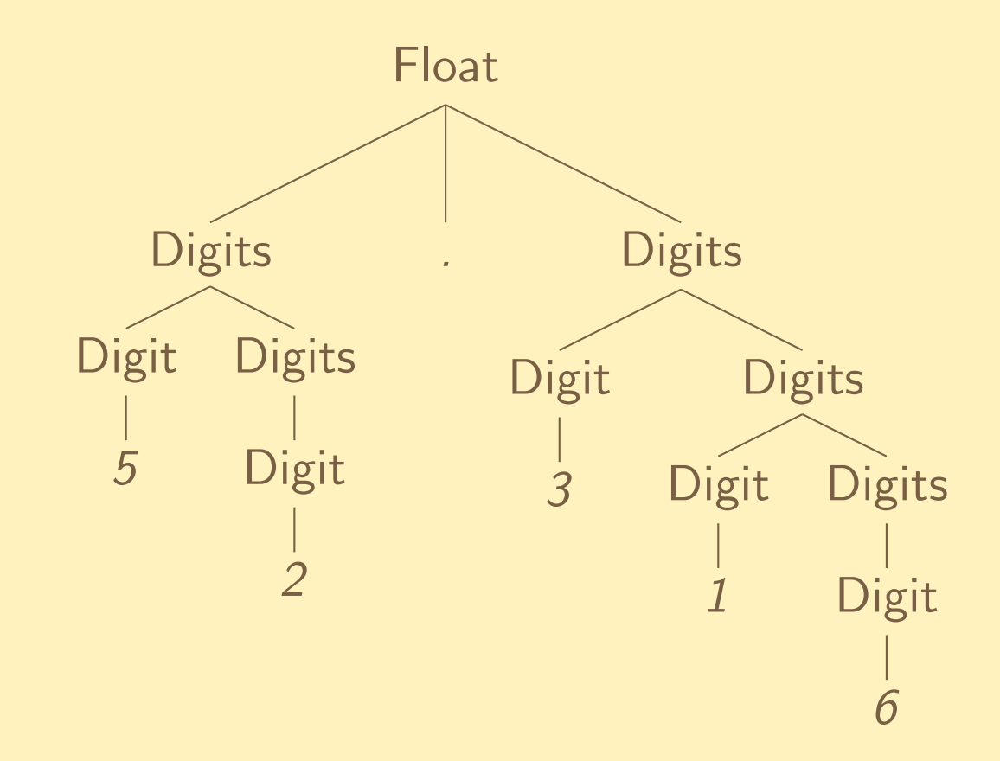

# Overview

> Lecture slide: [click here](https://www.kdocs.cn/p/104545603342)

History, standards, syntax, semantics, grammars, parsing.
<br>
Readings: Scott, ch 1 - 2
<br>
See [resources folder](https://newclasses.nyu.edu/portal/site/dd700183-e7c5-4095-b7c7-84d4f34b722f/tool/77e1f123-557e-4781-8580-6713673dc39e?panel=Main) for language standards documents: C11, C++17, ECMA-262, ECMA-334, and JLS15.

## Programming paradigms

### Imperative (von Neumann)

Such as: Fortran, Pascal, C, Ada

- programs have mutable storage (state) modified by assignments
- the most common and familiar paradigm

### Functional (applicative)

Such as: Scheme, Lisp, ML, Haskell

- functions are first-class values
- side effects (e.g., assignments) discouraged

### Logical (declarative)

Such as: Prolog, Mercury

- programs are sets of assertions and rules

### Object-Oriented

Such as: Simula 67, Smalltalk, C++, Ada95, Java, C#

- data structures and their operations are bundled together
- inheritance

### Quantum

Such as: QCL, Q, Q#, qGCL

- performs operations on data using quantum bits (“qubits”)
- utilizes quantum properties such as superposition and entanglement

## BNF (Backus-Naur Form)

Does not add expressiveness to the language—for convenience only.

- alernation: `<Symb> ::= <Letter> | <Digit>`
- sequencing: `<Id> ::= <Letter> <Symb>`

### BNF Building blocks

1. Numbers of a and b are equal (in any order):

```
<E> :== a <E> b <E> | b <E> a <E> | ε
```

2. a is more:

```
<A> :== <E> a <A> | <E> a <E>
```

## EBNF (Extended Backus-Naur Form)

Encompasses everything BNF has, plus:

- repetition:
- - zero or more: `{<Symb>}` or `<Symb>*`
- - one or more: `<Digit>+`
- option: `[<Digit>]`
- grouping: `('+'|'-')`

## The Chomsky hierarchy

### Regular grammars (Type 3)

- all productions can be written in the form: N ::= TN
- one non-terminal on left side; at most one on right
- generally used for scanners

### Context-free grammars (Type 2)

- all productions can be written in the form:N ::= XYZ
- one non-terminal on the left-hand side; mixture on right
- most major programming languages

### Context-sensitive grammars (Type 1):

- number of symbols on the left is no greater than on the right
- no production shrinks the size of the sentential form
- used for parts of C++, but otherwise rarely used

### Type-0 grammars

no restrictions

## Regular expressions

> **Regular grammars** can be used to generate regular languages.<br>**Regular expressions** can be used to accept regular languages.

- `ε` denotes `∅`
- a character `x`, where `x ∈ Σ`, denotes `{x}`
- sequencing: a sequence of two regular expressions `RS` denotes
  `{αβ | α ∈ [R], β ∈ [S]}`
- alternation: `R|S` denotes `[R] ∪ [S]`
- Kleene star: `R*` denotes the set of strings which are concatenations of
  zero or more strings from `[R]`
- grouping: parentheses `(A|B)`

**Shorthands**

```
R? ≡ ε|R
R+ ≡ RR*
```

**Conventions**

```
. ≡ any α ∈ Σ (“any character”)

[abc] ≡ (a|b|c)
[^abc] ≡ Σ \ {a, b, c}
[0-9] ≡ (0|1|2|3|4|5|6|7|8|9)
a-z and A-Z
```

## Parse tree

A parse tree describes the grammatical structure of a sentence

- leaf nodes are terminal symbols
- internal nodes are non-terminal symbols
- construction of tree from sentence is called _parsing_

**Example:**

Input string: `52.316`

Grammar:

```
<Float> ::= <Digits> | <Digits> '.' <Digits>
<Digits> ::= <Digit> | <Digit> <Digits>
<Digit> ::= '0'|'1'|'2'|'3'|'4'|'5'|'6'|'7'|'8'|'9'
```

Parse tree:



## Grammar ambiguity

If the parse tree for a sentence is not unique, the grammar is ambiguous.

> From recitation: A CFG is ambiguous if it has more than one parse tree for some strings. i.e. there is more than 1 derivation for a string.

### "Dangling if" rewrite solution

```
<S> ::= <M> | <U>
<O> ::= <V> ‘=’ <E> | <S> ‘;’ <S>
<M> ::= ‘if’ <B> ‘then’ <M> ‘else’ <M> | <O>
<U> ::= ‘if’ <B> ‘then’ <S> | ‘if’ <B> ‘then’ <M> ‘else’ <U>
<B> ::= <E> ‘===’ <E>
<V> ::= ‘x’ | ‘y’ | ‘z’
<E> ::= <V> | ‘0’ | ‘1’ | ‘2’ | ‘3’
```

### Precedence

If we say operator `*` has precedence over operator `+`. This means expression `5 + 2 * 3` should be evaluated as: `5 + (2 * 3)`, <span style="color:red">not</span> `(5 + 2) * 3`.

**Precedence can be specified in two ways:**

- Write precedence directly into the rules: higher precedence appear in deeper rules.
- Write an ambiguous grammar first, then specify operator precedence separately.

### Associativity

Associativity tells the parser what to do with operators at the same level of
precedence.

For example, `5 - (2 - 3)` verses `(5 - 2) - 3`. Two `-` operators have the same precedence. However, how you associate them will yield different mathematical results.

Usually, you can specify using _left_ associativity or _right_ associativity.

## Scanners and parsers

Scanners (or tokenizers) read in text and extract tokens. Parsers read in tokens and construct a parse tree.

### LL parsers

LL (Left-to-right, Leftmost derivation) parsers are also called top-down, recursive descent or predictive parsers. It begins at the root symbol.

`LL(k)`: means `k` look ahead.

**Problems with LL parsing:**

- Left recursion: a grammar is left-recursive if there exists non-terminal `A` such that `<A> ::= <A> α` for some `α`.
- Common prefixes: if there exists a non-terminal `A` and terminal `b` such that there exists rule R1 `<A> ::= b ...` and R2 `<A> ::= b ...`.

**How to eliminate left-recursive problem:**

Original:

```
A → Aα1| Aα2 | … | Aαm | β1 | β2 | … | βn
```

Convert to:

```
A  → β1A' | β2 A' | … | βnA'
A' → α1A' | α2A' | … | αmA' | ε
```
