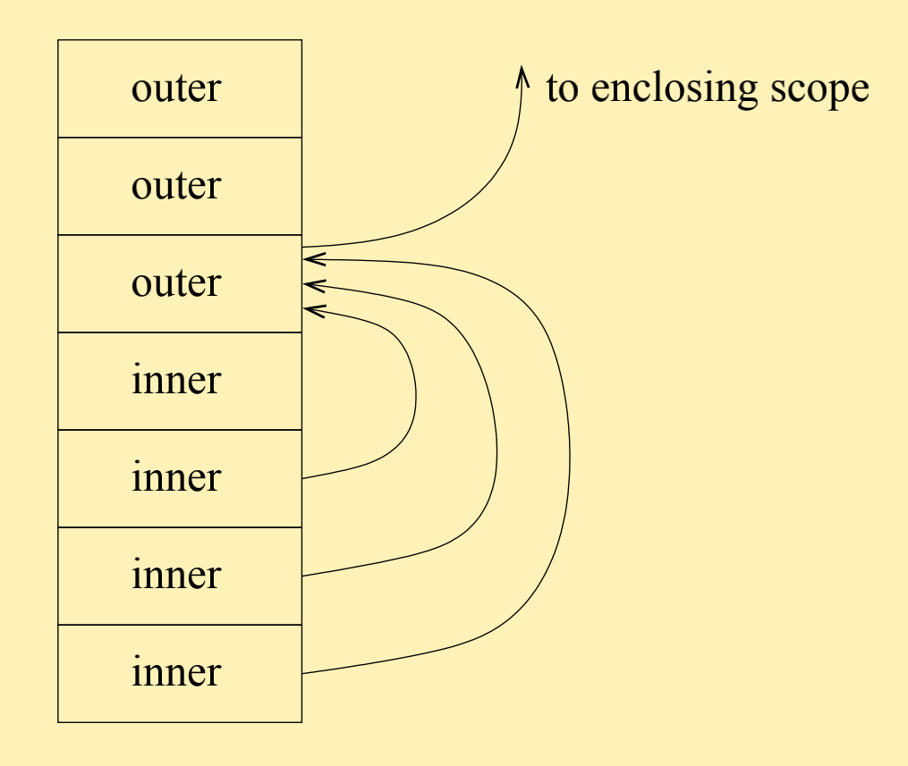

# Subprograms

> Lecture slide: [click here](https://www.kdocs.cn/p/104545603342)

Functions and procedures. Parameter passing. Nested procedures. First-class and higher-order functions. Implementation issues.
<br>
Readings: Scott, ch 6, 8.1 - 8.3

## Parameter passing

When defining functions, the names of variables we give are called (formal) parameters.

```js
function f(a, b, c) ... // parameters: a, b, c
```

When calling function, the values or variables we feed are called (actual) arguments.

```js
f(i, 2 / i, g(i, j)); // arguments: i, 2/i, g(i, j)
```

### Methods of passing

- **by value**: formal is bound to value of actual.
- **by reference**: formal is bound to location of actual.
- **by copy-return**: formal is bound to value of actual; upon return from routine, actual gets copy of formal.
- **by name**: formal is bound to expression for actual; expression evaluated whenever needed; writes to parameter are allowed (and can affect other parameters!)
- **by need**: formal is bound to expression for actual; expression evaluated the first time its value is needed; cannot write to parameters.

### Passing in practical languages

- Ada: semantic intent is separated from passing implementation. Parameter modes: `in`(default, read-only in subprogram), `out`(write in subprogram) and `in out`(read-write in subprogram).
- C: parameter passing by value, no semantic checks. Assignment to formal is assignment to local copy.
- C++: default is by-value. Can explicitly pass parameter by reference: `void incr (int& y)`.
- Java: by value only. Just different semantics for primitive types and objects.

## Runtime organizations

Each subprogram invocation creates an activation record.
<br>
Recursion imposes stack allocation.

- **activation record**: hold actuals, linkage information, saved registers, local entities.
- **caller**: place actuals on stack, return address, linkage information, then transfer control to callee.
- **prologue**: (before) save registers, allocate space for locals.
- **epilogue**: (after) place return value in register or stack position, update actuals, restore registers, then transfer control to caller.
- **binding of locations**: actuals and locals are at fixed offsets from frame pointers.
- **complications**: variable # of actuals, dynamic objects.

## Activation record

Layout:
<br>


**Frame pointer**: pointing to the head/base of the stack frame/activation record
<br>
**Stack pointer**: pointing to the top of the stack

### Variable number of parameters

Consider C function `printf`:

```c
printf("this is %d a format %d string", x, y);
```

`printf` can have variable length of parameters. Within body of printf, we need to locate as many actuals as placeholders in the format string.

Solution: place parameters on stack in reverse order (actuals at positive offset from the frame pointer, locals at negative offset from the frame pointer)


### Call conventions

Subprogram callers and callees must completely agree on who does what, how, and when. These details are encompassed in a protocol known as the _calling convention_.

- C (`cdecl`): Parameters placed on the stack in right-to-left order. Caller required to clear the stack parameters.
- Microsoft Standard (`stdcall`): called function required to clear the stack parameters.
- Fast Call (`fastcall`): up to two parameters placed in hardware registers. Rest on the stack.
- Microsoft C++ (`thiscall`): the "this" pointer passed through the CX register (x86)

### Objects of dynamic size

Two solutions to handle objects of dynamic size on activation record:

- Solution 1: use indirection: activation record holds pointers simpler implementation, costly dynamic allocation/deallocation.
- Solution 2: local indirection: activation record holds offset into stack faster allocation/deallocation, complex implementation.

## Global linkage

**Static chain/link** is a pointer to activation record of statically enclosing scope.
<br>
**Display** is an array of pointers to activation records.

> Functional languages, however, do not use global linkage because they allocate activation records on heap.

### Static links

Set up as part of call prologue. To retrieve entity n scopes out, need n dereference operations.



### Display

O(1) display lookup: one entry per scoping level (known at compile time),
plus dereference.


## First-class & higher-order functions

Allowing functions as first-class values forces heap allocation of activation
records. Also, environment of function definition must be preserved until the point of
call: activation record cannot be reclaimed if it creates functions.

As a result, functional languages require more complex run-time management.

### Higher-order functions

Higher-order functions are the functions that take (other) functions as arguments
and/or return functions. (A function that takes/returns pointers to functions can also be considered a higher-order function.)

How they are restricted in different languages:

- C: no nested definitions, so environment is always global.
- C++: ditto, except for nested classes.
- Ada: static checks to reject possible dangling references.
- Modula: pointer to function illegal if function not declared at top-level.
- ML, Haskell: no restrictions. For example, compose function: `fun compose f g x = f (g x)`
