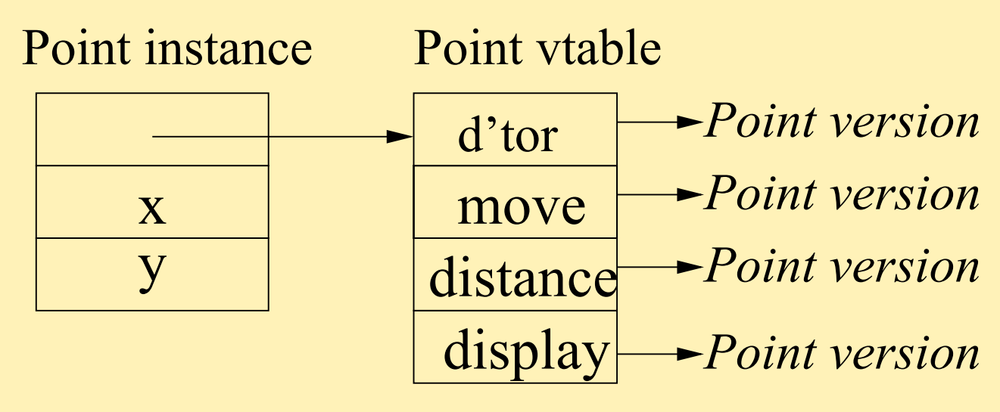
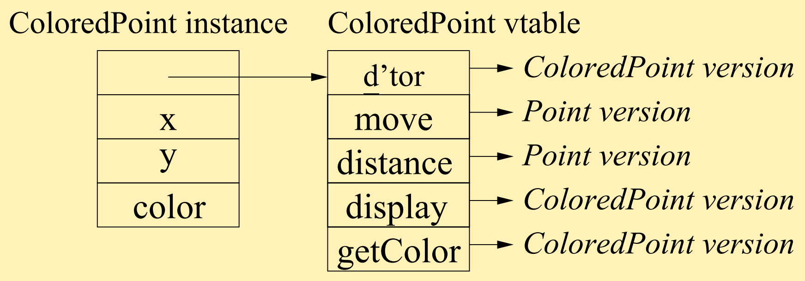

# OOP

> Lecture slide: [click here](https://www.kdocs.cn/p/111952867211)

Objects, classes, data and function members, constructors/destructors. OOP in C++ and Java, objects vs closures, classes vs datatypes, OO pitfalls.
<br>
Readings: Scott ch 3.3.4-3.3.5, 3.7, Stroustrup ch. 8-9 (optional), Arnold ch. 13 (optional).

[[toc]]

## Styles of OOLs (object oriented languages)

### Class-based

In a class-based OOP language, each object is an instance of a class.

### Prototype-based

In a prototype-based OOP language, each object is a clone of another object, possibly, with modifications and/or additions.

Example:

```js
var original = {a: 'A', b: 'B'};
var clone = owl.util.clone(original);
// clone.a == 'A'
// clone.b == 'B'
clone.a = 'Apple';
// clone.a == 'Apple'
// original.a == 'A' // unchanged
original.b = 'Banana';
// clone.b == 'Banana' // change shows through
clone.c = 'Car';
// original.c is undefined
original.a = 'Blah';
// clone.a == 'Apple' // clone's new val hides original
delete clone.a;
// clone.a == 'Blah' // original value visible again
// repeating "delete clone.a" won 't delete orig.value
```

## Classes in C++

Example:

```cpp
class Point {
  double m_x, m_y; // private data members
public:
  Point (double x, double y) // constructor
    : m_x (x), m_y (y) {}
  virtual ~Point () {}
  virtual void move (double dx, double dy) {
    m_x += dx; m_y += dy;
  }
  virtual double distance (const Point & p) {
    double xdist = m_x - p.m_x, ydist = m_y - p.m_y;
    return sqrt (xdist * xdist + ydist * ydist);
  }
  virtual void display () { ... }
};
```

### Extending a class

Example:

```cpp
class ColoredPoint : public Point {
  Color color;
public:
  ColoredPoint (double x ,double y, Color c)
    : Point (x ,y), color ( c ) {}
  ColoredPoint (Color c) : Point (0.0, 0.0), color (c) { }
  virtual Color getColor () {return color;}
  virtual void display () { ... } // now in color!
};
```

### Dynamic despatching by vtable

**vtable** is used to determine which class' method to invoke.
<br>
`virtual` method means: "use the subclass version" (including all descendant subclasses). Virtual methods are placed in the _vtable_.

- `Point` class vtable example:

  

- `ColoredPoint`:

  

## OOP pitfalls
